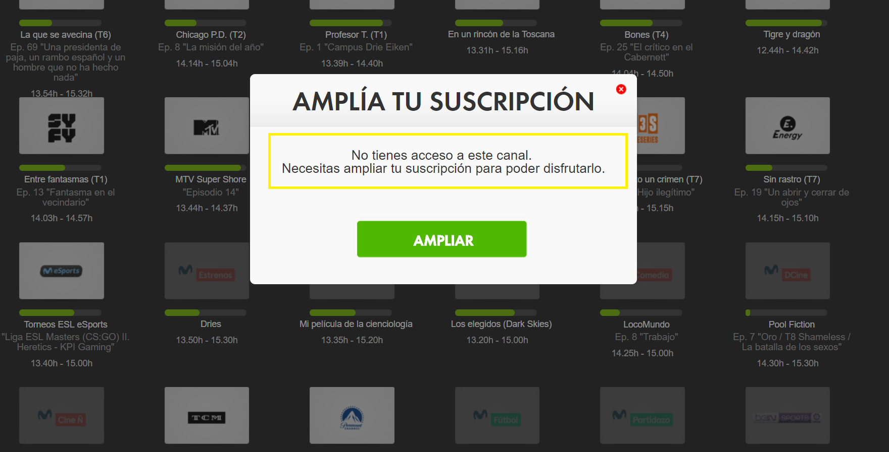
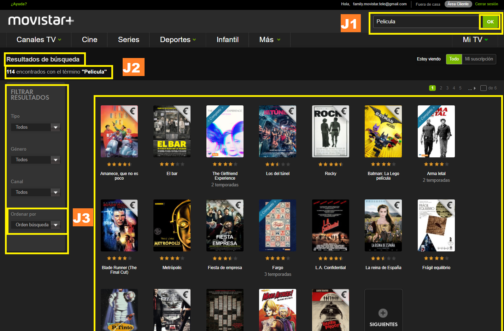

\newpage

\hypersetup{hidelinks}
\setcounter{tocdepth}{2}
\tableofcontents

\newpage

# 1. Introduction

This document details the design process involved with ideating a video content platform we proposed that we named TubeVision. First, we generated three user personas which would provide us with the background, motivations, inclinations, and contextualization for the potential users of TubeVision. Afterwards, we analyzed three popular video content platforms (YouTube, Hulu, and Movistar+) using the Nielsen Heuristics and the Van Duyne Design Patterns in order to explore how design principles were effectively and ineffectively being implemented by competitors. This competitor analysis inspired some of the design for TubeVision, however, the majority of the design came from identifying the key features and functions desired by the three user personas established in the beginning. A desired functionality from one of the user personas was used as a scenario for which our platform, TubeVision, would address. Demonstrating this scenario’s solution was achieved through a high fidelity (Hi-Fi) mockup prototype. Throughout this design process, the documentation of each of these steps took place to ensure thorough details would be preserved.

\newpage

# 2. Analyzing the users

### User 1: Ana
Ana is a 34 year old banker from New York City. She leads a fast-paced lifestyle and needs to keep track of the financial markets every day for her work. She is a high-strung, no-nonsense person who wants to get the information she wants, right when she wants it. She has a high spending capacity and is willing to spend money on solutions that make her life more comfortable and efficient. Ana commutes to work in taxis and makes the most of her commute by catching up on the overnight movements in the stock market and the world news through Bloomberg and Wall Street Journal videos on her smartphone. While she has a high degree of technical proficiency, she prefers using Siri and speech-to-text systems to interface with the device instead of using the phone’s keyboard. In her free time, she enjoys traveling and going on outdoor excursions to remote parts of the exotic countries she visits. Sometimes there is no cellular data in these remote locations, which greatly irritates Ana. She would like to be able to see the travel and excursion videos that she watched before her trip, during her trip so that she can be reminded of what to visit and where to go during her vacation.

### User 2: Tom
Tom is a 21 year old student. He studies Political Science at Carlos III University of Madrid. He needs an easy way to stay informed about the latest world news and have access to the most important television news channels. Furthermore, in some classes, he is required to see conferences and speeches of politicians. On the other hand, he enjoys watching other types of videos for entertainment, such as late night shows and Stand-up comedy. Additionally, he likes watching TV series and films in his free time. Tom lives in a shared room in the center of Madrid and since his studies take up a lot of his time he cannot work, so he appreciates web pages where he can find the information that he needs as fast as possible and where there is no need to pay for a premium account to obtain good services. It takes him more than 1 hour to commute to the university every day and he wants to use that time productively. At home he does not have a TV, but he has a good internet connection that allows him to use his devices as a TV, although when he is outside his cellphone connection is limited. He is interested in new technologies and it is not a problem for him to use a new web site even if it is complex, but since he spends a lot of time in front of a screen, he prefers web pages where everything is distributed in a clear and harmonious way that does not tire his eyes. He is looking for a web page for watching videos where he can find both academic and entertaining videos and that can be used for seeing TV channels.

### User 3: Laura
Laura is a 66 year old grandmother, who is retired and likes to spend as much time with her three grandchildren, Robert (age 3), Samuel (age 5), and Paula (age 6). She typically takes care of her grandchildren after school while their parents are busy at work. In doing so, she usually cooks dinner for her grandchildren while they watch videos on her computer in the living room. When she is not taking care of her grandchildren, Laura likes to learn about war histories, which occasionally involves watching graphic war films on her computer. She worries that her grandchildren might see this graphic content when using her computer. Furthermore, she is only interested in films and videos in English because it is the only language that she knows and she is not able to read subtitles. Laura uses glasses and does most of her history learning through online videos and multimedia, since her poor eyesight makes it difficult for her to read. To this end, she uses websites with large text and navigational tools in order to watch her videos and films. Moreover, sometimes she is unable to use certain websites because they are too complicated for her to understand. She does not understand how a payout via internet works and does not trust on spending her money on web sites. An important problem for her in most web pages is the invasive advertising as she is not able to distinguish between real and fake information and this put in risk her devices security. When a problem occurs or she cannot find something, she has to wait until her son visits her. She dislikes depending on him all the time so she likes sites where she can easily find a trusted phone number to contact customer support, but she has to be very sure that the calls are going to be for free and that she is going to be attended by a human and not a machine.

\newpage

# 3. Analysis of similar websites

## 3.1. Youtube

### 3.1.1. Context
YouTube is an American video-sharing website which allows users to upload, view, rate, share, add to favorites, report, comment on videos, and subscribe to other users. It offers a wide variety of user-generated and corporate media videos. Available content includes video clips, TV show clips, music videos, short and documentary films, audio recordings, movie trailers, live streams, and other content such as video blogging, short original videos, and educational videos. Most of the content on YouTube is uploaded by individuals, but other media corporations offer some of their material via YouTube.

Unregistered users can only watch videos on the site, while registered users are permitted to upload an unlimited number of videos and add comments to videos. Videos deemed potentially inappropriate are available only to registered users affirming themselves to be at least 18 years old. YouTube earns advertising revenue from Google AdSense, a program which targets ads according to site content and audience. The majority of its videos are free to view, but there are exceptions.

### 3.1.2. Nielsen's Heuristics

1. Visibility of system status

Progression bar with different colors. Black for unloaded content, gray for loaded, red for reproduced content and yellow for advertising parts.
There is also a bar showing the like-dislike rate.

2. Match between system and real world

The system uses common expression for describing categories, which helps the user to understand what the links do.

3. User control and freedom

There is a clearly marked  “emergency exit” buttons for important actions. The action button is more hidden in order to prevent unintended consequences.

4. Consistency and standards
Significant inconsistencies were not found

5. Error prevention

6. Recognition rather than recall

Predictive options on search.

7. Flexibility and efficiency of use

Many options for customizing your youtube channel or account. There is no need to customize your account for a nice use of the system, but the settings add a lot of functionalities for experienced and professional users.

8. Aesthetic and minimalist design

Minimalist design that makes it easy for the user to navigate the website

9. Help users recognize, diagnose, and recover from errors

The system shows descriptive error messages in a natural way. But it does not show how to recover from that error, like showing a message saying that you can search for similar videos.

10. Help and documentation

Help button is in the settings menu, not particularly easy to find for inexperienced users.

### 3.1.3 Van Duyne Patterns

1. E1: Site Branding

2. H2: Sign-In/New Account

\newpage

## 3.2. Movistar+

### 3.2.1 Context
Movistar+ is a subscription platform for digital television. The web platform was created with the aim of allowing users to access the digital TV channels package from any device with internet connection. TV programs can be stopped, fast forward, rewind or recorded   while seeing. In addition to provide access to national and international television channels through the internet, it also includes the possibility of seeing Movies, series, sport matches, documentaries and more.

### 3.2.2. Nielsen's Heuristics

1. Visibility of system status

While reproducing videos we can see the progression bar.
When a content is charging there is an animation that point the work in progress.

2. Match between system and real world

3. User control and freedom

Confirmation and identification message when buying new packages.

4. Consistency and standards

5. Error prevention

6. Recognition rather than recall

7. Flexibility and efficiency of use

There are no tools that allow experienced users to tailor frequent actions.

8. Aesthetic and minimalist design

9. Help users recognize, diagnose, and recover from errors

The platform prevents the user from making mistakes. The unallowed options can not be selected, and in the case that we can choose one of them, a message explaining the steps for being able to select that option is shown.

10. Help and documentation

### 3.2.3 Van Duyne Patterns

1. B: Navigation Framework

- B1:Search and navigation tools placed at the top and start of the page.
- B2:Content organized in categories that make sense to the users in an intuitive way.
- B3:Hierarchical organization with descriptive category names. However, there are some generic terms.
- B7:Popularity based organization
- B8: The pages are categorized by highlighting in the navigation bar the section in which the user is.

2. J: Making Site Search Fast and Relevant

- J1: Search action module
- J2: Search engine that does not require extreme precision
- J3: Organized search result based

\newpage

## 3.3. Hulu

### 3.3.1 Context
Hulu is an American subscription video on demand service. It is primarily oriented towards television series, carrying current and past episodes of series from its owners' respective television networks and other content partners. Hulu users can instantly stream current-season episodes of primetime TV shows, clips, movies and more. A Hulu membership is required for access to content on Hulu, and this membership is offered on two tiers for subscribers, a commercial-free tier and a limited commercial tier. The commercial-free tier is more expensive than the limited-commercial tier for the added benefit of enjoying ad-free programming. For viewers who choose to watch content with limited commercials, Hulu shows fewer commercials than scheduled television.

### 3.3.2. Nielsen's Heuristics

1. Visibility of System status

Accessing my account requires re-entering my password, as expressed to me by the system prompt.

2. Help and Documentation

Help center allows for open ended questions, instead of browsing through tons of help information.

3. Recognition Rather than Recall

Specific movie options shown for simple recognition of desired content

4. Help Users Recognize, Diagnose, and Recover from Errors

Specific error message denotes that the password or email is incorrect and below the error message is a link to recover forgotten authentication credentials.

### 3.3.3 Van Duyne Patterns

1. D4: Personalized Content

Personalized content and options to refine personalized content by selecting whether or not a recommendation is good.

2. E4: Privacy Policy

3. E5: About Us

4. H11: Predictive Input

5. K4: Action Buttons

Action buttons which prompt the user to start a Hulu trial membership or engage with the platform on social media.

6. K14: Page Not Found

The “Page Not Found” page has alternative options below the page not found error message.

\newpage

# 4. Design

## 4.1. Main goal of the tool
*Tubevision*, our video content platform, is a multimedia website for a diverse audience of users. Designed as an easy-to-use website, it features the ability to browse for content by category and to search for content through the use of a search box. Users to the website must subscribe in order to access the video content on the website, which spans from user-uploaded videos to TV streaming content to movies/films.  In addition, *Tubevision* is accessible via a mobile device or a traditional desktop computer.

The webpage is monetized through two forms: 1) premium subscriptions and 2) pre-content video ads. Premium subscriptions are paid versions of subscription accounts which enables special features not available to non-premium subscribers, such as unlimited offline video downloads, unlimited movies, speech interface, and video advertisement-free content. Instead of invasive display ads on the side panel, non-premium users are shown short video ads spanning several seconds before their selected video content plays.

## 4.2. Functionalities included in the tool

### 4.2.1. Required Functionalities

- The webpage can be used with or without a subscription. From now on, functionalities for subscribed users are marked as (S), for not subscribed as (NS) and for all, subscribed and not subscribed, as (A).
- Watch and share videos. (A)
- Can navigate published videos and basic information about them (description, likes, sharings,  keywords). (A)
- Search for videos related to a specific topic. (A)
- Sign up to the website. (NS)
- Interact  with  the videos (likes, comments and sharings in  other  social networks). (S)
- Save favorite videos. (S)
- Create a public or private playlist. (S)
- Follow  a playlist created by other users. (S)
- Create a collaborative list where other users can participate and add content. (S)

### 4.2.2. Extracted from the 3 personas analysis

#### Ana inspired functionalities
- New category: premium users (P)
- Curated Content for a Particular Category (Finance, Travel)
- Mobile-friendly user interface
- Integration with 3rd party apps
- Speech Interface
- Offline Version of Videos

#### Tom inspired functionalities
- Curated Content for a Particular Category (Politics, Comedy)
- Non-Premium Service
- Simple Layout
- Offline Version of Videos
- Web Video Content
- TV Streaming

#### Laura inspired functionalities
- Age control for graphic content
- Desktop Friendly
- Language Control - Filter for English Content
- Large Text to Assist Visual Impairment
- Simple Layout
- Advertising-free (P)
- Toll-Free, U.S. based Customer Support Concierge

### 4.2.3. Other design ideas extracted from the platforms analysis

#### YouTube inspired
- Menu of Video Categories
- Sign In Button (differentiates Subscribed vs Unsubscribed Users)
- Non-Premium and Premium Service (Youtube Red)
- Previously Seen Videos Featured on Home Page
- Videos Similar to Previously Seen Videos Featured on Home Page
- Watch Films through the Platform (Youtube Movies)
- Watch TV through the Platform (Youtube TV)
- Pre-content video ads
- Error tolerant search engine
- Build trust and credibility by making secure connections, branding, and adding sections as about us and privacy policy explaining in a clear and simple way the terms, conditions and global aim of the platform.

#### Movistar+ inspired
- Ask for the password before make important changes in the account settings or before buy new features.
- Access to TV channels in real time
- Organize TV channels following the channels number name and based on most viewed by the user.
- Chronological order in the TV programs organized by channel
- Prevent that users can select not allowed options rather than showing error messages.
- Show the new TV series and movies and the next releases.
- Visible and accessible help button.
- Personalize the search by being able to sort and filter the result

#### Hulu inspired

- Personally Curated Content Based on Preferences
- Large High-Resolution Pictures of Video Content as the Link to the Content
- Simple Top Menu Bar Showing TV, Movies, Kids, etc. Categories
- Large, Bold Text Describing a Content Group Followed by Examples of Video Content from the Group
- Recommendations Page with an “Are You Interested? (Yes/No)” feature attached to each video which learns from your interests to provide you more relevant video recommendations

## 4.3. Scenario

Laura’s grandchildren have arrived home from school and she is about to go to the kitchen to cook for them, when she remembers that she was previously watching a graphic documentary on the torture of prisoners during the Roman Empire. She doesn’t want this nor any other graphic content to be accessible to her grandchildren while she is away in the kitchen and they are using her computer, so she enables the parental control on her account. She clicks on account settings, confirms her password, and enables parental control. Thus, she can step away from her grandchildren in the living room with the peace of mind that they will not be watching any mature content.

## 4.4. Prototype

